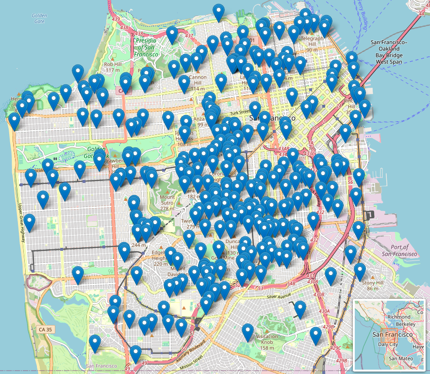
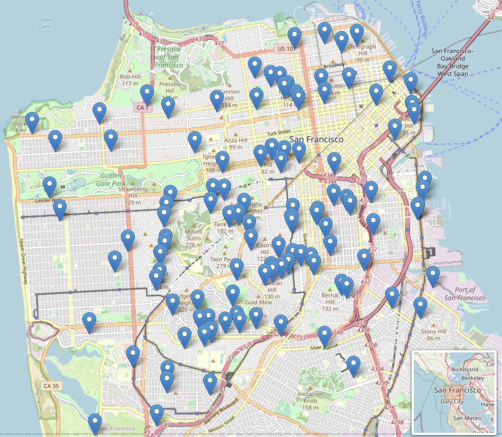
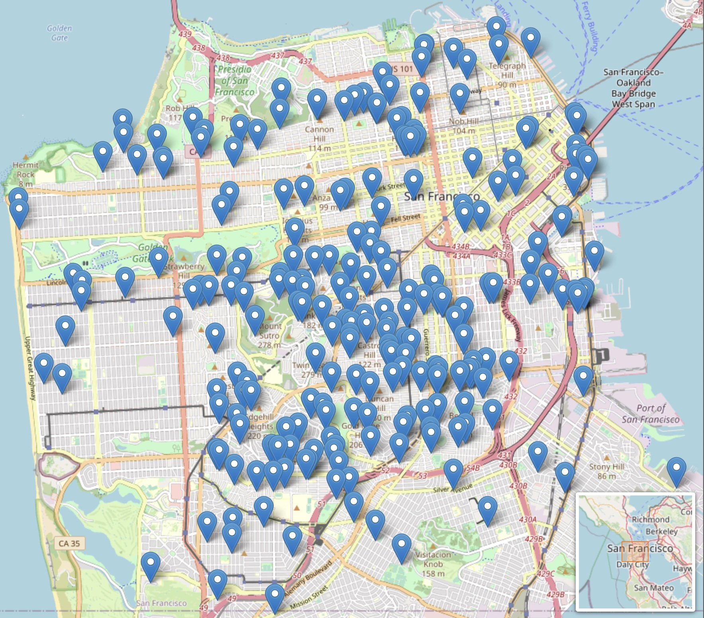
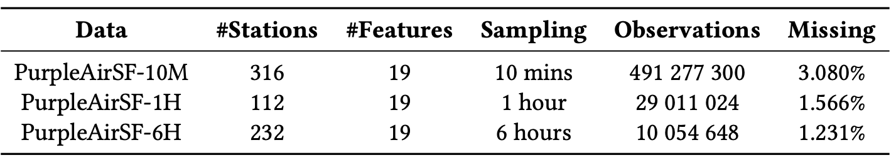
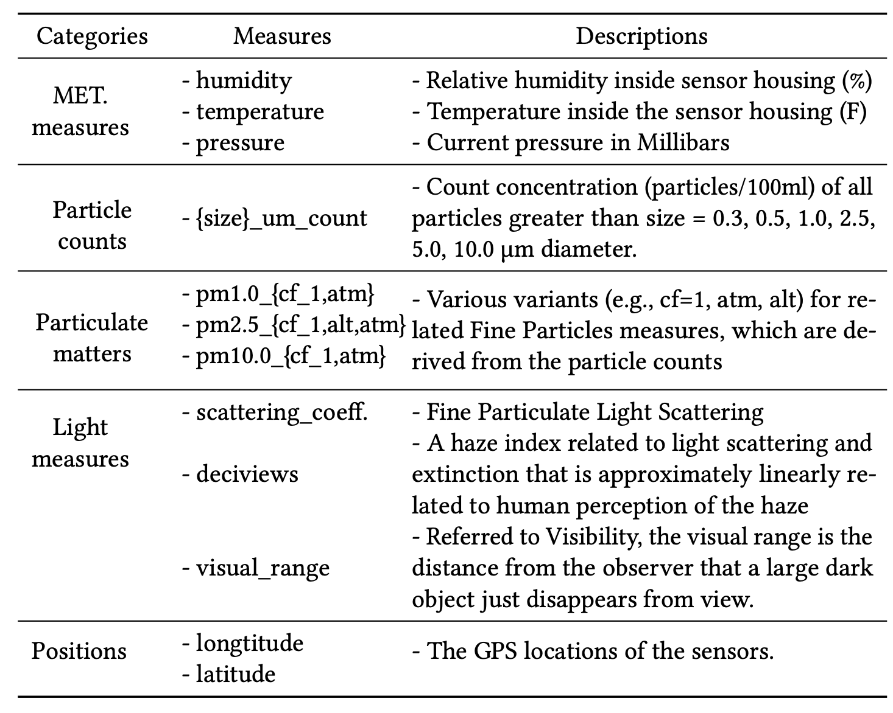

## Unleashing Realistic Air Quality Forecasting: Introducing the Ready-to-Use PurpleAirSF Dataset

This is the companion repository for the PurpleAirSF Dataset. Paper will be released soon.

The preprocessed datasets can be downloaded [here](https://tiiuae-my.sharepoint.com/:f:/g/personal/michele_baldo_tii_ae/EjAMg7MVY69KvTWdn7oUvlEBtRo0UWmTgVI1fVpB1lCV7g?e=nSmjQe) 

### Datasets with three temporal granularities are provided:
- PurpleAirSF-10M:  10-minute sampling frequency/granularity 
- PurpleAirSF-1H:   one-hour sampling frequency/granularity 
- PurpleAirSF-6H:   six-hour sampling frequency/granularity 


<p float="left">
  
   
  
  <figcaption> Figure 1 (Left): 10-min granular data with 316 stations; (Middle): 1-hour granular data with 232 stations; (Right): 6-hour granular data with 112 stations</figcaption>
</p>
The statistical summary of the datasets are shown in the below table: 
<p float="left">
  
</p>


## How to use PurpleAirSF?

In each archived file, we provide 
```
- IDS.json:         JSON file including the IDs of the sensor stations 
- sensor-loc.csv:   GPS locations (longitude, latitude) of each sensor station 
- map.html:         Sensor stations visualized in a Map
- data.npy:         Preprocessed meteorological and air quality measures 
```

The preprocessed data has a shape of (N, L, F)
```
- N: the number of sensor stations
- L: the entire sequence length
- F: the number of features/measures in each station. 
```

Users are free to split the dataset with different window size. 

Here are a list of ordered measures that we considered during data collection:
```
    'humidity', 'temperature', 'pressure',
    'pm2.5_alt', 'scattering_coefficient', 'deciviews', 'visual_range',
    '0.3_um_count', '0.5_um_count', '1.0_um_count', '2.5_um_count',
    '5.0_um_count', '10.0_um_count', 'pm1.0_cf_1', 'pm1.0_atm', 'pm2.5_atm',
    'pm2.5_cf_1', 'pm10.0_atm', 'pm10.0_cf_1'
```

The detailed descriptions of the measures are shown in the below table: 
<p float="left">
  
</p>


## How to obtain the raw data from PurpleAir?

Users can also use our provided scripts to fetch raw data from PurpleAir via PurpleAir API.

### Step 1: Private key application
For some feature you need the private keys for the APIs.

1. Create an PurpleAir account

2. Write a email to contact@purpleair.com with subject "API keys for PurpleAirAPI". 
They will send you your API private key. Once you have it, just create a file in `keys/PurpleAir_API_key.conf`
with the following structure:
```
[purpleair.com]
API_readKey = YOUR-PRIVATE-READ-KEY
```

### Step 2: Use the provided scripts for data acquisition and pre-processings
- *'main_purpleair_to_csv.py'*: fetch raw data and save to '.csv' files
- *'csv_data_load.py'*: pre-process the '.csv' files and save to dataframe with target format, i.e., with shape of (N, L, F)


## Citation

If you find this data useful in your research, please consider citing the following paper:

```script
@misc{zuo2023unleashing,
  title     = {Unleashing Realistic Air Quality Forecasting: Introducing the Ready-to-Use PurpleAirSF Dataset },
  author    = {Zuo, Jingwei and Li, Wenbin and Baldo, Michele and Hacid, Hakim},
  year      = {2023}
}
```